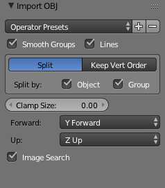

## A note about using Blender to import obj files

I found that I needed to set my .obj import options as follows for blender to
import the file without changing coordinates:

Namely, `Forward: Y Forward` and `Up: Z Up`.